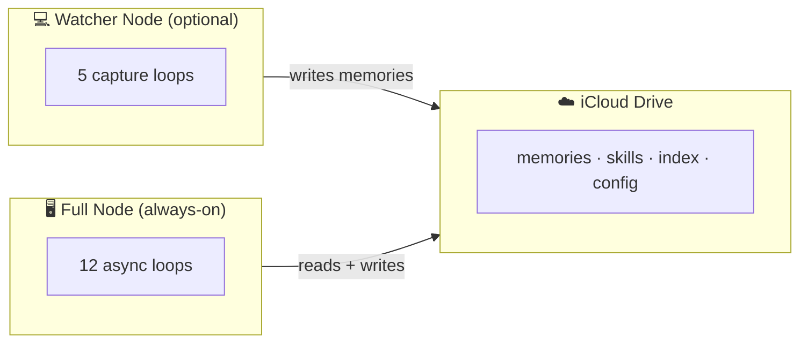
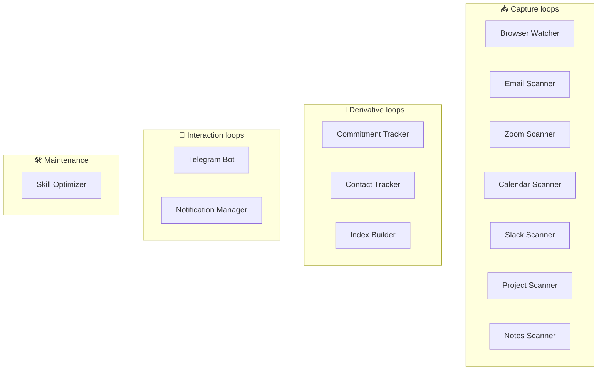
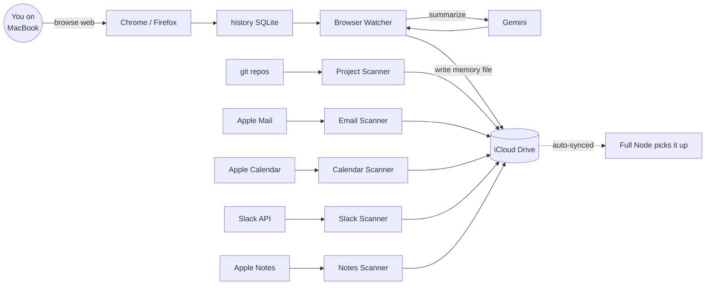
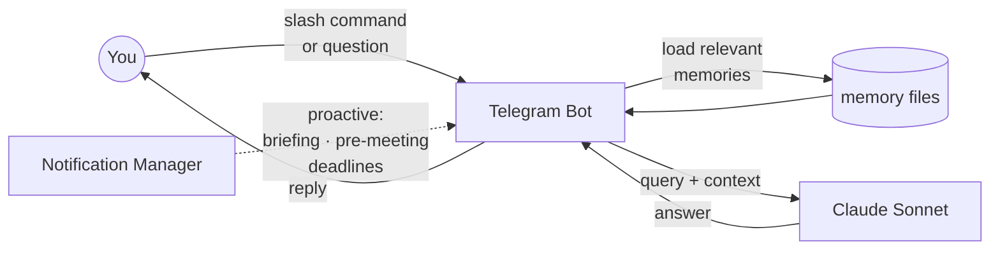
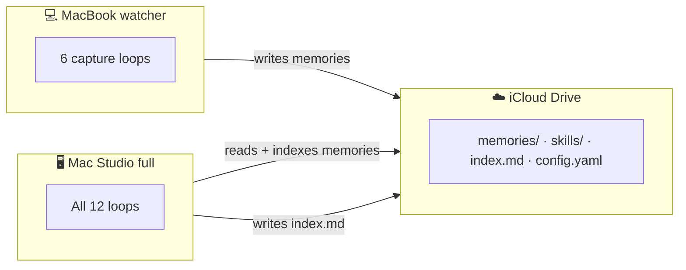
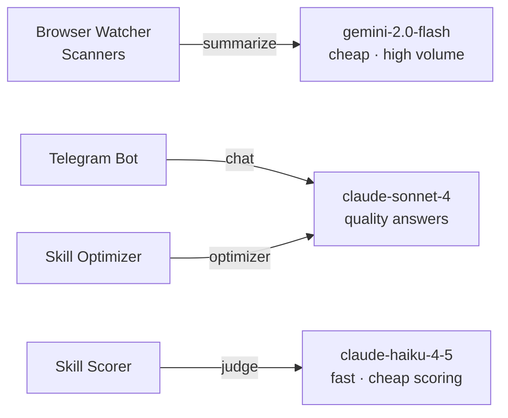
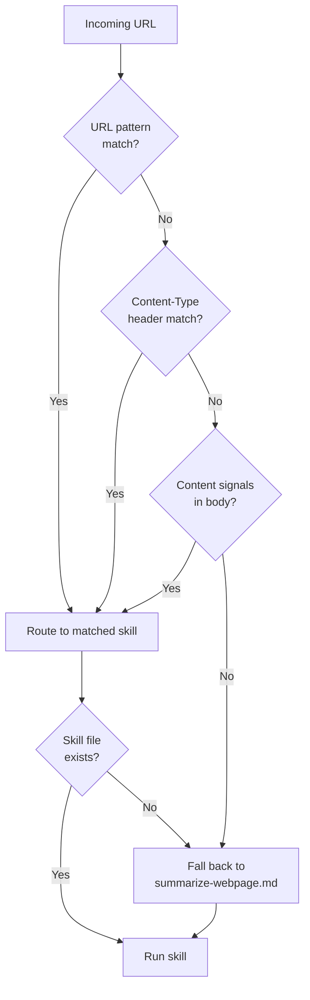
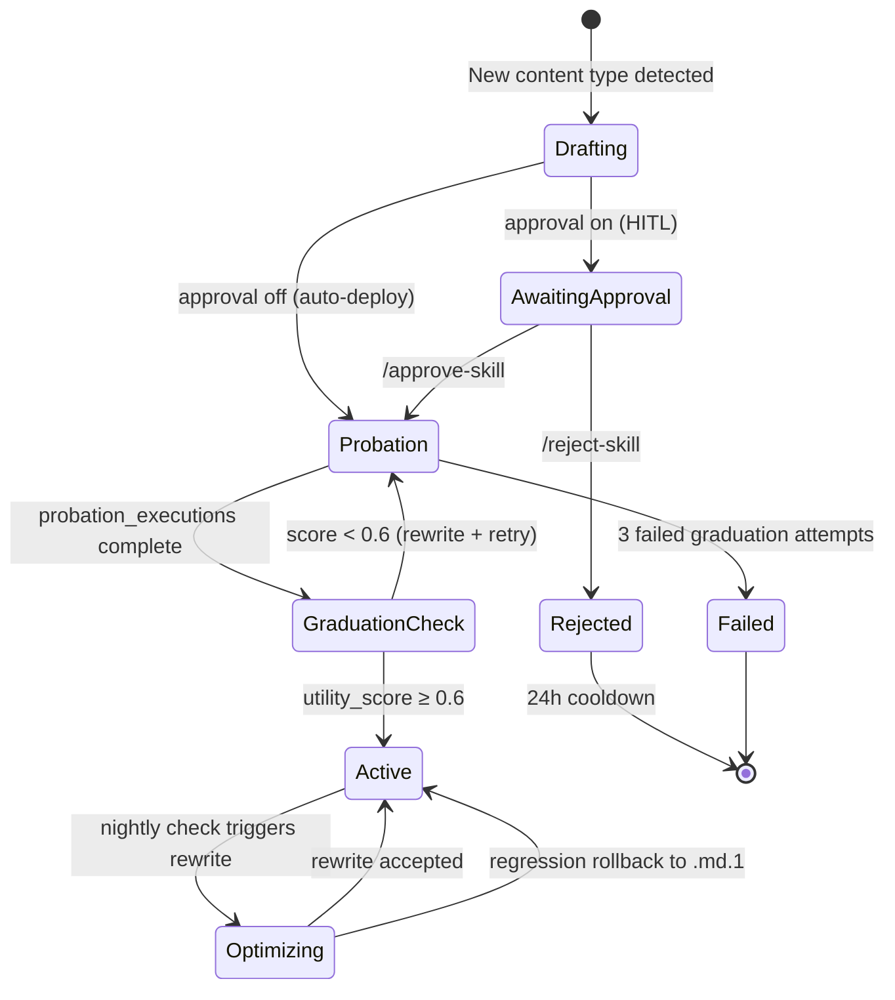

<div align="center">

# Felix

**A personal agent for your knowledge and activity.**


*Ask questions like "What did I read about Rust async last week?" or "Who was on that call about the API redesign?" and get instant answers pulled from your accumulated context.*

</div>

---

## Table of Contents

- [What you can do with it](#what-you-can-do-with-it)
- [Architecture](#architecture)
- [How to use it](#how-to-use-it)
  - [Finding information about a person](#finding-information-about-a-person)
  - [Tracking commitments](#tracking-commitments)
  - [Browsing recent activity](#browsing-recent-activity)
  - [Searching across all your knowledge](#searching-across-all-your-knowledge)
  - [Controlling what gets captured](#controlling-what-gets-captured)
  - [Managing summarizer quality](#managing-summarizer-quality)
  - [Feature and bug tracking](#feature-and-bug-tracking)
  - [Managing proactive notifications](#managing-proactive-notifications)
- [Complete command reference](#complete-command-reference)
- [Quick install](#quick-install)
- [What gets installed where](#what-gets-installed-where)
- [Prerequisites](#prerequisites)
- [Manual setup](#manual-setup)
- [Running the daemon](#running-the-daemon)
- [Verifying it works](#verifying-it-works)
- [Multi-machine setup (watcher node)](#multi-machine-setup-watcher-node)
- [LLM routing (LiteLLM)](#llm-routing-litellm)
- [Skill optimization and quality](#skill-optimization-and-quality)
- [macOS permissions](#macos-permissions)
- [Optional integrations](#optional-integrations)
- [License](#license)
- [Files never to commit](#files-never-to-commit)

---

## What you can do with it

Felix is a personal knowledge system that automatically captures everything you interact with — web pages, emails, meetings, calendar events, Slack threads, Apple Notes, code projects — summarizes it all with LLMs, and stores it as searchable flat files in iCloud Drive. A Telegram bot gives you instant access.

**Philosophy:** No vector DB, no embeddings, no graph. Files + LLM = database.

**Never lose track of what you've read.** Browse an article on your laptop, summarize it automatically, ask your bot about it days later from your phone. Works across all your devices via iCloud sync.

**Search your entire work context in one place.** Find people, commitments, projects, meetings, email threads, and calendar events through natural language queries. The bot loads relevant memories into Claude's context and answers from your accumulated knowledge.

**Get proactive notifications.** Morning briefing with today's calendar and due commitments. Context push 10 minutes before each meeting (who's attending, related commitments, recent threads). Deadline alerts for commitments due today or tomorrow.

**Track commitments automatically.** The system extracts action items from meetings and emails, writes them as structured memory files, and surfaces them via `/commitments`. Mark them `/complete` or `/dismiss` as you work through them. Get accuracy stats with `/accuracy`.

**Build a living contact graph.** Every participant in every email, meeting, calendar event, Slack thread, or shared Apple Note becomes a contact with a relationship score, interaction history, and links to related threads. Search with `/contacts` or `/contact <name>`.

**Control what gets captured.** Skip noisy domains with `/skip reddit.com`, purge unwanted memories with `/purge <domain>`, and manage your ignore list with `/skiplist` and `/unskip`.

**Get better summaries as the system learns.** Felix routes each captured page to a specialized summarizer — research papers, API docs, code repos, and video transcripts each get their own prompt. A nightly optimizer scores past runs, catches declining skills early, and rewrites the weakest ones. Check skill health any time with `/skill-health`.

---

## Architecture

Felix runs on two kinds of machines: a **full node** (always-on Mac like a Mac Studio or Mac Mini) that runs all the processing, and optional **watcher nodes** (laptops) that capture browser history, git repos, email, calendar, Slack, and Apple Notes while you're traveling. Both sync through iCloud Drive.

### Deployment topology

Two kinds of machines, one shared filesystem.



### Full node loops

The full node runs 12 async loops, grouped by purpose.



### Watcher node

A watcher machine runs six capture loops: browser history, git repos, email threads, calendar events, Slack threads, and Apple Notes. It writes memory files to iCloud; the full node picks them up and indexes them.



### Telegram interaction

Everything you do with Felix goes through Telegram, in one of two directions: you ask, or Felix proactively tells you.



### End-to-end data flow

Putting it all together, here is how data moves from sources through scanners to memories and back to you:

```mermaid
flowchart LR
    BH[Browser History] --> BW[Browser Watcher]
    MAIL[Apple Mail] --> ES[Email Scanner]
    ZOOM[Zoom API] --> ZS[Zoom Scanner]
    GIT[git repos] --> PS[Project Scanner]
    CAL[Apple Calendar] --> CS[Calendar Scanner]
    SLACK[Slack API] --> SS[Slack Scanner]
    NOTES[Apple Notes] --> NS[Notes Scanner]

    BW --> MEM[(memories/)]
    ES --> ET[email-thread-*.md]
    ZS --> MT[meeting-*.md]
    PS --> PJ[project-{hostname}-*.md]
    CS --> CE[calendar-event-*.md]
    SS --> ST[slack-thread-*.md]
    NS --> NT[apple-notes-*.md]

    ET --> MEM
    MT --> MEM
    PJ --> MEM
    CE --> MEM
    ST --> MEM
    NT --> MEM

    MEM --> IB[Index Builder]
    IB --> IDX[index.md]

    ET --> CT[Commitment Tracker]
    MT --> CT
    CT --> CM[commitment-*.md]

    MEM --> CON[Contact Tracker]
    CM --> CON
    CON --> CX[contact-*.md]

    MEM --> TG[Telegram Bot]
    IDX --> TG
    TG --> API[Claude API]
    API --> YOU([YOU])

    CE --> NM[Notification Manager]
    CM --> NM
    NM --> TG
```

**Key design:** iCloud Drive is the shared bus. Watcher nodes write memories (browser history, git repos, email threads, calendar events, Slack threads, Apple Notes), full node picks them up and indexes them. Config is shared via iCloud; per-machine role is set via `SECOND_BRAIN_ROLE` env var in the launchd plist (NOT in config.yaml, which would sync everywhere). Project memory files are hostname-scoped (`project-{hostname}-{name}.md`) so the same repo can be tracked on multiple machines without filename collisions.

**Specialized summarizers.** Felix doesn't use one generic prompt for everything. It classifies each URL into one of five content types (research paper, API docs, code repo, video transcript, or default web page) and routes to a specialized skill — `summarize-paper.md`, `summarize-docs.md`, `summarize-repo.md`, `summarize-transcript.md`, or `summarize-webpage.md`. When a new content type appears that has no matching skill, the daemon can draft one automatically. See *Skill optimization and quality* below.

---

## How to use it

The bot is your main interface. All commands are sent via Telegram.

**Network resilience:** If replies can't be delivered due to network issues, they're queued to `~/secondbrain/pending-replies.json`. When connectivity is restored, you'll receive a notification with `/deliver` (send queued replies) and `/discard` (drop them) commands.

### Finding information about a person

```
/contacts                # list everyone you've interacted with, sorted by recency
/contacts 50             # show more results (max 50)
/contact Alice Chen      # detailed view: interaction history, relationship score, related threads
/contact 3               # show contact #3 from the last /contacts list
```

Contacts are deduplicated by email address. The system picks the longest display name it's seen (e.g. "Alice Chen" beats "Alice"). Relationship score is recency-weighted: yesterday's interaction contributes 1.0, last week's contributes ~0.5, 10 days ago contributes 0.1.

### Tracking commitments

```
/commitments             # show all active commitments (outbound, inbound, waiting-on)
/commitments outbound    # filter to just things you committed to do
/commitments inbound     # filter to things others committed to you
/commitments waiting     # filter to things you're waiting on

/complete 3              # mark commitment #3 done
/dismiss 3               # dismiss #3 (false positive or no longer relevant)

/todo Clean my desk                          # personal todo (auto-classified)
/todo Get the report to Jane due:2026-05-01  # outbound, with due date
/todo Follow up with John type:inbound       # force classification

/wrong 3                 # mark extracted commitment as false positive (improves accuracy stats)
/missed                  # manually add a commitment the bot missed (multi-step form for external sources)
/accuracy                # show extraction precision per source type (email, meeting, etc.)
```

Items with low confidence (0.5–0.69) show a ⚠️ indicator. The default threshold is 0.7 for auto-active, configurable via `commitment_tracker.min_confidence` in `config.yaml`.

### Todo checklist view

`/todos` shows all active commitments as a checkbox-style todo list — a read-at-a-glance alternative to `/commitments`:

```
/todos                   # show all active commitments as [ ] checklist
/todos done 3            # mark todo #3 complete
/todos done 3 5          # mark multiple todos complete in one command
/todos dismiss 3         # dismiss todo #3
```

Personal commitments are shown without a type tag; extracted items from meetings and emails show their type in brackets (e.g. `[outbound]`).

### Tracking goals

```
/addgoal                 # conversational flow to create a new goal
/goals                   # list active goals
/goals personal          # filter by category (personal, work, family, learning, other)
/goals completed         # filter by status (active, completed, abandoned)
/goal 3                  # show full detail of goal #3 from the last list

/completegoal 3          # mark goal #3 as completed
/abandongoal 3           # mark goal #3 as abandoned

/goal_note 3 Spoke to coach today about training plan   # append a timestamped note to goal #3
/goal_due 3 2026-09-30   # update the due date on goal #3
/goal_due 3 none         # clear the due date on goal #3
```

Goals represent outcomes you want to achieve. Each has a category, optional due date, and priority. You can also create goals through natural language: say "I want to run a 5K by June" and the assistant will create the goal automatically.

Goals with approaching deadlines receive proactive notifications at 7 days and 1 day before the due date (unless you've muted notifications via `/mute`).

### Tracking projects

```
/addproject              # conversational flow to create a new project
/projects                # list active projects
/projects work           # filter by category
/projects completed      # filter by status (active, completed, abandoned, on-hold)
/project 3               # show project detail with milestone list

/completeproject 3       # mark project #3 as completed
/abandonproject 3        # mark project #3 as abandoned
/holdproject 3           # put project #3 on hold

/addmilestone 3 Lock feature scope       # add a milestone to project #3
/milestone 3 2           # toggle milestone #2 on project #3 (done/undone)

/project_note 3 Kicked off design sprint   # append a timestamped note to project #3
/project_due 3 2026-10-31   # update the due date on project #3
/project_due 3 none          # clear the due date on project #3

/linkgoal 3 2            # link project #3 to goal #2 (from last /goals list)
/unlinkgoal 3            # remove the goal link from project #3
```

Projects track efforts you're working on — any domain, any scale. Unlike goals (which are outcomes), projects are the actual work. Projects support inline milestones and can be linked to a parent goal.

Categories are configurable via `goals.categories` in config.yaml (default: `personal`, `work`, `family`, `learning`, `other`). The `code` category is reserved for auto-scanned repositories (see below).

Projects with approaching deadlines receive the same 7-day and 1-day notifications as goals.

### Reviewing discovered projects

The assistant can infer projects from your emails, meetings, and Slack threads. Newly discovered code repositories can also require confirmation before being indexed (see `code_scanner.require_confirmation` in config).

Discovered items appear as candidates until you confirm or reject them:

```
/review                  # list pending candidates
/review 3                # show detail for candidate #3 (with evidence)
/confirm 3               # confirm candidate #3 as a real project or code repo
/confirm 3 work          # confirm and override the category guess
/reject 3                # reject candidate #3 (won't be re-proposed)
/review_purge [N]        # bulk-delete pending candidates older than N days (default 30)
/edit 3 due_date=2026-08-01  # edit a field on candidate #3 before confirming
```

**Configuration:**
```yaml
project_inference:
  enabled: true
  scan_interval_min: 15
  confidence_threshold: 0.7
  source_types: [email_thread, meeting_transcript, slack_thread]
  candidate_ttl_days: 30        # auto-delete pending candidates older than this
  max_pending_candidates: 200   # cap total pending candidates; oldest deleted first

code_scanner:
  require_confirmation: false  # set true to require confirmation for new repos
```

### Browsing recent activity

```
/memories [N]            # list your N most recent web captures (default 10, max 50)
/memory <N>              # show full detail of memory N from the last list

/meetings [N]            # list meeting transcripts, newest first
/meeting <N>             # show meeting detail: attendees, summary, transcript

/comms [N]               # unified email + Slack + LLM chat threads, most recent first
/comms email [N]         # filter to email only
/comms slack [N]         # filter to Slack only
/comms llm [N]           # filter to imported Claude/ChatGPT chats only
/comm <N>                # show thread detail

/aichat [N]              # list imported Claude/ChatGPT conversations, grouped by platform
/aichat <N>              # show conversation detail: summary, topics, tags
/aichat search <query>   # keyword search across imported conversations

/events [N]              # calendar events in a ±7-day window, sorted by start time
/event <N>               # event detail: time, location, attendees, description, related commitments

/code [N]                # list indexed git repos, sorted by last commit (default 10)
/code 3                  # show code repo #3 detail: description, languages, commits, README summary

/notes [N]               # list Apple Notes, sorted by modification date (default 20, max 50)
/notes 3                 # show note #3 detail: folder, content, tags
/notes todos             # show notes flagged as todo-related
/notes <folder>          # filter to notes in a specific folder (e.g., /notes Work)
```

> **Upgrade note:** If you have existing `project-{hostname}-*.md` memory files from a previous version, they are automatically migrated to `code-{hostname}-*.md` on first daemon startup after upgrading.

All list commands accept an optional count (default 10, max 50). The `<N>` argument in detail commands refers to the index from the last list or search.

### Searching across all your knowledge

```
/search rust async       # search ALL memory types — grouped results: Contacts, Commitments, Goals, Projects, Code repos, Meetings, Emails, Slack, Events, Web
/search email rust async # filter to one type: email, slack, meeting, goal, project, code, commitment, event, contact, web
```

Results are grouped by type with up to 5 per group. If a group has more than 5, you'll see a hint like "12 more — try `/search email rust async`" to filter.

### Controlling what gets captured

```
/skip reddit.com         # add domain to ignore list
/skiplist                # show all skipped domains
/unskip reddit.com       # remove domain from ignore list

/purge reddit.com        # delete all memories whose URL contains "reddit.com"
/purgeall                # delete memories for every domain on the skip list

/delete 3                # delete memory #3 from the last list or search
```

The skip list is stored in `config.yaml` under `browser_watcher.skip_domains`. Changes take effect within 5 minutes (next watcher poll).

### Manually capturing a URL

You can save any URL as a memory on demand — useful for links that didn't get auto-captured or for content you want to revisit with more detail.

```
/remember https://example.com/article          # standard capture (auto-detect skill)
/remember https://example.com/paper deep       # rich notes — quotes, open questions
/remember https://example.com/blog quick       # concise 3-point capture (fast)

# Numeric aliases for quick typing
/remember https://example.com/article 1        # quick
/remember https://example.com/article 2        # standard (default)
/remember https://example.com/article 3        # deep

/note https://example.com/paper                # alias for /remember <url> deep
/deepen 3                                      # re-process reading #3 at deep level
```

Depth levels:

| Depth | Skill | Output |
|-------|-------|--------|
| `quick` / `1` | `summarize-webpage-quick` | 1-2 sentence summary + 3 key points |
| `standard` / `2` (default) | Auto-detected per content type | Full summary + key points + entities |
| `deep` / `3` | `summarize-webpage-detailed` | Multi-paragraph summary, 8-15 key points, quotes, open questions |

The `standard` depth auto-routes: research papers → `summarize-deep`, API docs → `summarize-docs`, code repos → `summarize-repo`, video transcripts → `summarize-transcript`, everything else → `summarize-webpage`.

### Managing summarizer quality

Felix runs a pool of specialized summarizer skills and improves them automatically. You can check their health, review auto-drafted skills before they go live, and control the approval workflow.

```
/skill-health             # utility scores and trend arrows for every skill

/skill-drafts             # list drafts the daemon has queued for your review
/skill-draft <N>          # show the full markdown of draft N
/approve-skill <N>        # accept draft N — it enters 5-run probation
/reject-skill <N>         # discard draft N; its content type is on a 24h cooldown

/skill-approval on        # require approval before any new skill goes live
/skill-approval off       # let the daemon auto-create skills (probation only)
/skill-approval status    # show effective mode
```

`/skill-health` shows a utility score for each skill — a recency-weighted mean of its recent execution scores — plus a trend arrow: `▲` improving, `▼` declining, `◆` stable, `—` new. A `⚠` flag marks skills below the underperformance threshold (default 0.70) or on a declining trend. Skills with fewer than three scored runs show `—` until they accumulate enough history.

When the browser watcher sees a URL whose content type has no matching skill, the daemon drafts a new one using Claude Sonnet. By default the draft is written directly to `skills/` and runs in **probation mode** — its output is discarded for the first five executions while the optimizer scores it. After probation, a daily graduation check promotes the skill to active if its utility score ≥ 0.6, or triggers a rewrite and re-probation if not (maximum three attempts before the skill is marked failed).

If you'd rather review drafts before they run, send `/skill-approval on`. New drafts land in `$BRAIN/skill-drafts/` and the bot sends you a Telegram notification; nothing executes until you `/approve-skill`. The runtime override survives daemon restarts.

### Feature and bug tracking

> Agent/Claude Code reference: `docs/finding-work.md` — label vocabulary, `gh` CLI recipes, local-file schema, and the autonomous drainer.

Felix includes a lightweight feature/bug tracker accessible via Telegram. You can optionally back it with GitHub Issues for full history and web UI access.

**Basic usage (local files):**

```
/feature Implement search by date range #enhancement
/bug Login fails on Safari #auth
/features                  # list all active items
/feature-detail 1          # show full detail
/feature-plan 1            # mark as planned
/feature-start 1           # mark in-progress
/feature-done 1 "Shipped in v1.2"
```

**GitHub Issues backing (optional):**

Set `GITHUB_PAT` (a Personal Access Token with `repo` scope) and `GITHUB_REPO` (`owner/repo`) during `./install.sh` prompts, or add them to the launchd plist manually. When configured:

- `/feature` and `/bug` create GitHub Issues instead of local files
- All lifecycle commands (`/feature-plan`, `/feature-done`, etc.) work unchanged
- The daemon maintains `memories/features-index.md` so the LLM context stays hydrated
- Use `/feature-import` to migrate existing local feature files to GitHub

**Label conventions:**

- `kind:feature` / `kind:bug` — type
- `status:planned` / `status:in-progress` — intermediate states (open issues only)
- `priority:low|medium|high|critical` — urgency
- Hashtags in the description become plain labels (e.g., `#auth`, `#enhancement`)

**Direct issue references:**

You can bypass the `/features` list and reference issues directly: `/feature-plan #42`, `/feature-done #42`, etc.

### Working the backlog autonomously

`scripts/work_reports.sh` (run from the repo root) drains the captured feature/bug backlog into PRs without further hand-holding. It:

1. Promotes any local `feature-request-*.md` files in iCloud memories to GitHub issues (mirrors `/feature_import` — uses the `gh` CLI, no daemon required).
2. Loops `claude -p` against open `kind:bug` and `kind:feature` issues, picking one per iteration, branching, implementing per `CLAUDE.md`, running tests, committing, and opening a PR with `Closes #NNN`.

Stops when Claude outputs `STOP` (no actionable issues left), the loop gets stuck (`STUCK_N` identical results), or `MAX_ITER` is hit. Logs go to `~/sisyphus-logs/`. Graceful stop: `rm ~/sisyphus-logs/secondbrain-work-reports.stop`.

```bash
scripts/work_reports.sh                       # defaults: MAX_ITER=20, SLEEP_SEC=10, STUCK_N=3
MAX_ITER=5 scripts/work_reports.sh            # do at most 5 iterations
scripts/promote_local_features.py --dry-run   # preview what would be promoted, don't touch anything
```

Requires `gh` authenticated against the target repo and `claude` CLI on PATH.

`scripts/babysit-with-review.sh` is a review-gated variant: after every PR, it runs a codex<->claude review cycle and, once codex reports zero blocking findings, automatically merges the PR (`gh pr merge --merge --delete-branch`) and redeploys the daemon (`NONINTERACTIVE=1 ./install.sh`) before the next iteration. Use this when you want every landed change reviewed before it ships.

```bash
scripts/babysit-with-review.sh                   # defaults: MAX_ITER=20, MAX_REVIEW_CYCLES=3
MAX_REVIEW_CYCLES=5 scripts/babysit-with-review.sh
```

### Managing proactive notifications

```
/briefing                # trigger today's briefing now (works even when muted)
/mute                    # suppress all proactive notifications
/unmute                  # resume proactive notifications
```

When unmuted, the bot sends:
- **Daily briefing** at the configured time (default 7:30 AM): today's calendar, due/overdue commitments, active projects (with milestone progress and `[new]` marker for recent ones), new memories since yesterday
- **Midday check-in** (default 12:00 PM): summary of all active commitments still due today
- **End-of-day reminder** (default 5:00 PM): final summary of commitments due today with a prompt to mark any done via `/complete N`
- **Pre-meeting context** 10 minutes before each calendar event: attendees, related commitments, recent email/Slack threads
- **Commitment deadline alerts** when items are due today or tomorrow
- **LLM chat refresh nudge** when imported Claude/ChatGPT conversations are stale (default: 14 days since last import, with 7-day cooldown between nudges)

Configure notification times in `config.yaml`:
```yaml
notifications:
  briefing_time: "07:30"      # Daily morning briefing
  midday_alert_time: "12:00"  # Midday commitment check-in
  eod_alert_time: "17:00"     # End-of-day commitment reminder
```

Each checkpoint fires at most once per calendar day. If the daemon is offline when a checkpoint time passes, the alert fires on restart only if still within 2 hours of the scheduled time — stale reminders are silently skipped.

Muted state persists across daemon restarts. `/briefing` works even when muted — useful for manually checking in without turning on auto-notifications.

### Getting help

```
/help                    # show all commands grouped by task (alias: /commands)
```

---

## Complete command reference

| Command | Effect |
|---------|--------|
| **Meta** | |
| `/help`, `/commands` | Show all available commands grouped by category |
| `/usage [days]` | Show LLM token usage per model for the last N days (default 7). Tracks prompt + completion tokens from all LiteLLM calls. |
| `/usage daily` | Per-day rolling totals for the last 7 days. |
| **Skill management** | |
| `/skill-health` | Utility scores and trend arrows for every skill. Sorted worst-first; `▲` improving, `▼` declining, `◆` stable, `—` insufficient data. `⚠` = below underperformance threshold or declining. |
| `/skill-drafts` | List auto-drafted skill files awaiting approval (only populated when `/skill-approval on`). |
| `/skill-draft <N>` | Show the full markdown of draft N from the last `/skill-drafts` list. |
| `/approve-skill <N>` | Promote draft N into `skills/`. Enters 5-run probation (output discarded while being scored). |
| `/reject-skill <N>` | Delete draft N. Its content type is blocked from re-triggering skill creation for 24 hours. |
| `/skill-approval on\|off\|status` | Runtime HITL toggle. `on` = require `/approve-skill` before new skills run. Overrides `config.yaml`; persists across restarts. |
| **People & contacts** | |
| `/contacts [N]` | List contacts sorted by most recent interaction (default 20, max 50). Deduplicated by email, display name is longest seen version, recency-weighted relationship score. |
| `/people [N]` | Alias for `/contacts` |
| `/contact <name\|N>` | Detailed contact view: interaction history, related threads, relationship score |
| **Goals** | |
| `/addgoal` | Start a conversational flow to create a new goal |
| `/goals [category\|status]` | List active goals; filter by category (personal, work, family, learning, other) or status (active, completed, abandoned) |
| `/goal <N>` | Show detail for goal N from the last list |
| `/completegoal <N>` | Mark goal N as completed |
| `/abandongoal <N>` | Mark goal N as abandoned |
| `/goal_note <N> <text>` | Append a timestamped note to goal N |
| `/goal_due <N> <YYYY-MM-DD\|none>` | Update or clear the due date on goal N |
| **Projects** | |
| `/addproject` | Create a new project (conversational flow) |
| `/projects [category\|status]` | List projects; status options: active, completed, abandoned, on-hold |
| `/project <N>` | Show project detail with milestone list |
| `/completeproject <N>` | Mark project N as completed |
| `/abandonproject <N>` | Mark project N as abandoned |
| `/holdproject <N>` | Put project N on hold |
| `/project_note <N> <text>` | Append a timestamped note to project N |
| `/project_due <N> <YYYY-MM-DD\|none>` | Update or clear the due date on project N |
| `/addmilestone <N> <text>` | Add a milestone to project N |
| `/milestone <N> <M>` | Toggle milestone M on project N (done/undone) |
| `/linkgoal <N> <M>` | Link project N to goal M (from last `/goals` list) |
| `/unlinkgoal <N>` | Remove the goal link from project N |
| **Candidate review** | |
| `/review [N]` | List pending candidates, or show detail for candidate N |
| `/confirm <N> [category]` | Confirm candidate N as a real project or code repo; optionally override category |
| `/reject <N>` | Reject candidate N (won't be re-proposed) |
| `/edit <N> field=value` | Edit a field on candidate N before confirming |
| **Code repositories** | |
| `/code [N]` | List indexed repos (default 10, max 50). Sorted by last commit. When the same repo exists on multiple machines, displays `hosts: [hostname1, hostname2]`. |
| **Apple Notes** | |
| `/notes [N]` | List Apple Notes, sorted by modification date (default 20, max 50) |
| `/notes <N>` | Show note detail: folder, content, tags |
| `/notes todos` | Show notes flagged as todo-related |
| `/notes <folder>` | Filter to notes in a specific folder (case-insensitive substring match) |
| **Calendar & meetings** | |
| `/events [N]` | Calendar events in ±7-day window, sorted by start time (default 10, max 50) |
| `/event <N>` | Event detail: time, location, attendees, description, related commitments |
| `/meetings [N]` | Zoom meeting transcripts, newest first (default 10, max 50) |
| `/meeting <N>` | Meeting detail: date, attendees, summary, transcript |
| **Communications** | |
| `/comms [email\|slack\|llm] [N]` | Unified email + Slack + imported LLM chats, most recent first (default 10, max 50). Optional filter arg. |
| `/messages [email\|slack\|llm] [N]` | Alias for `/comms` |
| `/communications [email\|slack\|llm] [N]` | Alias for `/comms` |
| `/comm <N>` | Thread detail (email-shaped, Slack-shaped, or llm_chat-shaped based on type) |
| `/message <N>` | Alias for `/comm` |
| `/communication <N>` | Alias for `/comm` |
| `/aichat [N]` | List imported Claude/ChatGPT conversations, grouped by platform (default 20) |
| `/aichat <N>` | Show conversation detail: summary, topics, tags |
| `/aichat search <query>` | Keyword search across imported conversation headers |
| **Commitments** | |
| `/commitments [type]` | Active commitments. Optional type filter: `outbound`, `inbound`, `waiting`. Items with confidence 0.5–0.69 show ⚠️. |
| `/todos` | All active commitments as a `[ ]` checklist. `/todos done N` to complete, `/todos dismiss N` to dismiss. |
| `/complete <N>` | Mark commitment N completed |
| `/dismiss <N>` | Dismiss commitment N (false positive or no longer relevant) |
| `/wrong <N>` | Mark extracted commitment as false positive (feeds accuracy stats) |
| `/missed` | Manually add a commitment the bot missed |
| `/accuracy` | Show extraction precision per source type |
| **Memory browsing** | |
| `/memories [N]` | List N most recent web captures (default 10, max 50) |
| `/search <query>` | Search across ALL memory types. Results grouped by type: Contacts, Commitments, Goals, Projects, Code repos, Meetings, Email threads, Slack threads, Calendar events, Web memories. Up to 5 per group, overflow hint shows `/search <type> <query>`. |
| `/search <type> <query>` | Filter to one type: `email`, `slack`, `meeting`, `goal`, `project`, `code`, `commitment`, `event`, `contact`, `web` |
| `/memory <N>` | Show full detail of item N from last list or search |
| `/delete <N>` | Delete item N from last list or search |
| `/rebuild_cache` | Force full rebuild of the SQLite memory cache. Use when cache seems stale or after manual edits to iCloud memories. |
| **Proactive notifications** | |
| `/briefing` | Trigger today's briefing now (works even when muted): today's calendar, due/overdue commitments, active projects with milestones, new memories |
| `/mute` | Suppress all proactive notifications (briefings, pre-meeting pushes, deadline alerts) |
| `/unmute` | Resume proactive notifications |
| **Domain filter** | |
| `/skip <domain>` | Add domain to ignore list (e.g. `/skip reddit.com`) |
| `/unskip <domain>` | Remove domain from ignore list |
| `/skiplist` | Show all currently skipped domains |
| `/purge <domain>` | Delete all captured memories whose URL contains domain |
| `/purgeall` | Delete memories for every domain on the skip list |
| **Scanner management** | |
| `/backfill <type> [days] [hostname]` | Force historical reprocessing without manual state file deletion. Types: `readings`, `email`, `zoom`, `calendar`, `slack`, `code`. Days default to 30 (90 max for readings/email/slack, 180 max for zoom/calendar, N/A for code). Optional hostname arg — if given and doesn't match current node, returns "cross-node not yet implemented". Derivative scanners (commitment_tracker, contact_tracker, project_inference_scanner) re-run automatically on next cycle due to updated mtimes. Full-role only. |
| **Feature & bug tracking** | |
| `/feature <description>` | Capture a new feature request (hashtags become labels) |
| `/bug <description>` | Capture a new bug report (hashtags become labels) |
| `/features [bug\|feature\|<status>] [N]` | List feature/bug backlog. Filters: `bug`, `feature`, `all`, `new`, `planned`, `in-progress`, `done`, `wont-do`. Default: new + planned + in-progress. |
| `/bugs` | Alias for `/features bug` |
| `/feature-detail <N\|#issue>` | Show full detail for feature N from last list, or GitHub issue #N |
| `/feature-plan <N\|#issue>` | Mark as planned |
| `/feature-start <N\|#issue>` | Mark as in-progress |
| `/feature-done <N\|#issue> [note]` | Mark as done (closed with `completed` reason in GitHub) |
| `/feature-wont-do <N\|#issue> [reason]` | Mark as won't-do (closed with `not_planned` reason in GitHub) |
| `/feature-priority <N\|#issue> <low\|medium\|high\|critical>` | Change priority |
| `/feature-note <N\|#issue> <text>` | Add a timestamped note (GitHub comment if backing enabled) |
| `/feature-import [confirm]` | One-time migration: import local feature files to GitHub issues (requires GitHub backing) |

---

## Quick install

```bash
./install.sh
```

The installer is idempotent — safe to run again after a key rotation, repo move, or on a second machine. It skips any step already completed (existing config, existing skill files with execution history, etc.) and reloads the launchd agent if it was already running.

---

## What gets installed where

```
Runtime state (local per machine):
~/secondbrain/
├── venv/                           # Python virtual environment
├── logs/                           # out.log, error.log (written by launchd)
├── seen-urls                       # processed URLs (browser watcher)
├── errors.log                      # LLM API errors
├── execution-log.jsonl             # watcher-node skill execution log
├── memory-cache.sqlite             # derived SQLite read-cache of all memory files; rebuilds automatically
├── email-scanner-state.json        # high-water ROWID for email scanner
├── zoom-scanner-state.json         # processed meeting UUIDs
├── commitment-scanner-state.json   # processed file mtimes
├── calendar-scanner-state.json     # processed event modification timestamps
├── contact-tracker-state.json      # processed file mtimes and interaction timestamps
├── slack-scanner-state.json        # processed Slack thread timestamps
├── project-inference-state.json    # mtime state for project inference scanner
├── commitment-corrections.jsonl    # /wrong and /missed feedback log
├── commitment-accuracy.json        # extraction precision stats per source type
├── rejected-candidates.json        # rejected candidate sources to prevent re-proposal
├── usage-tracker-state.json        # daily token usage per model (30-day rolling window)
├── notification-state.json         # chat_id, mute state, sent alerts
└── notes-scanner-state.json        # processed Apple Notes modification timestamps

iCloud (shared across all machines):
~/Library/Mobile Documents/com~apple~CloudDocs/second-brain/
├── memories/       # All knowledge files — one .md per item
├── skills/                 # LLM prompt templates with embedded execution history
│   ├── summarize-webpage.md    # default (all URLs not matched below)
│   ├── summarize-paper.md      # research papers, PDFs, arxiv/doi/semanticscholar
│   ├── summarize-docs.md       # API docs, readthedocs, developer portals
│   ├── summarize-repo.md       # GitHub/GitLab/Bitbucket repos
│   ├── summarize-transcript.md # YouTube, video transcripts
│   ├── chat.md                 # Telegram Q&A
│   ├── skill-optimizer.md      # meta-skill for critique-then-edit rewrites
│   └── *.md.1 .. *.md.5        # rolling backups written by the nightly optimizer
├── skill-drafts/           # auto-drafted skills awaiting /approve-skill (HITL mode only)
├── skills-registry.json    # skill lifecycle ledger: status, probation counts, approval mode
├── inbox/          # Raw captures pending processing
├── index.md        # Hourly rolling synthesis (~400-500 words)
└── config.yaml     # Shared config (DO NOT put machine-specific settings here)
```

---

## Prerequisites

- macOS (uses iCloud Drive and launchd)
- Python 3.11+
- A [Gemini API key](https://aistudio.google.com/app/apikey) (all nodes)
- An [Anthropic API key](https://console.anthropic.com/) (full node only)
- A Telegram account

---

## Manual setup

If you prefer to set up steps individually:

### 1. Create the iCloud directory structure

```bash
BRAIN="$HOME/Library/Mobile Documents/com~apple~CloudDocs/second-brain"
mkdir -p "$BRAIN/memories" "$BRAIN/skills" "$BRAIN/inbox"
```

### 2. Copy and configure `config.yaml`

```bash
cp config.yaml.template "$BRAIN/config.yaml"
```

Open `$BRAIN/config.yaml` and fill in:

```yaml
user:
  telegram_user_id: YOUR_NUMERIC_USER_ID   # see step 4
  name: Your Name

telegram:
  bot_token: YOUR_BOT_TOKEN                # see step 3
```

Leave everything else as-is to start. Adjust `skip_domains` to taste.

### 3. Create a Telegram bot

1. Open Telegram, message `@BotFather`
2. Send `/newbot` and follow the prompts
3. Copy the token it gives you into `config.yaml` → `telegram.bot_token`

### 4. Get your Telegram user ID

1. Message `@userinfobot` on Telegram
2. It replies with your numeric user ID
3. Copy it into `config.yaml` → `user.telegram_user_id`

The bot ignores all messages from users not on this whitelist.

### 5. Copy skill files to iCloud

```bash
BRAIN="$HOME/Library/Mobile Documents/com~apple~CloudDocs/second-brain"
cp skills/*.md "$BRAIN/skills/"
```

This copies all seven skill files — `chat.md`, `skill-optimizer.md`, plus the five content-type summarizers (`summarize-webpage`, `summarize-paper`, `summarize-docs`, `summarize-repo`, `summarize-transcript`). The skill router selects the right one for each captured URL automatically; adding a custom specialization later is as simple as dropping a new `summarize-*.md` file into `skills/` and running `./install.sh`.

### 6. Create the LiteLLM routing config

```bash
mkdir -p ~/.litellm
cat > ~/.litellm/config.yaml << 'EOF'
model_list:
  - model_name: summarize
    litellm_params:
      model: gemini/gemini-2.0-flash
      api_key: os.environ/GEMINI_API_KEY

  - model_name: chat
    litellm_params:
      model: claude-sonnet-4-20250514
      api_key: os.environ/ANTHROPIC_API_KEY

  - model_name: optimizer
    litellm_params:
      model: claude-sonnet-4-20250514
      api_key: os.environ/ANTHROPIC_API_KEY

  - model_name: judge
    litellm_params:
      model: claude-haiku-4-5-20251001
      api_key: os.environ/ANTHROPIC_API_KEY

router_settings:
  num_retries: 2
EOF
```

### 7. Create the virtual environment and install dependencies

```bash
python3 -m venv ~/secondbrain/venv
mkdir -p ~/secondbrain/logs

# Full node
~/secondbrain/venv/bin/pip install -r requirements.txt

# Watcher node (leaner — no Telegram)
~/secondbrain/venv/bin/pip install litellm httpx beautifulsoup4 lxml pyyaml
```

### 8. Set API keys

Add to your shell profile (`~/.zshrc` or `~/.bash_profile`):

```bash
export GEMINI_API_KEY="your-key-here"
export ANTHROPIC_API_KEY="your-key-here"
```

Then reload: `source ~/.zshrc`

---

## Running the daemon

### Production (launchd — runs on login, restarts on crash)

After running `./install.sh`, the daemon is configured to start automatically via launchd. Logs go to `~/secondbrain/logs/out.log` and `~/secondbrain/logs/error.log`.

To manually control the daemon:

```bash
# Stop
launchctl unload ~/Library/LaunchAgents/com.chrisrobertson.secondbrain.plist

# Start
launchctl load ~/Library/LaunchAgents/com.chrisrobertson.secondbrain.plist

# Reload after code changes (or just run ./install.sh)
launchctl unload ~/Library/LaunchAgents/com.chrisrobertson.secondbrain.plist
launchctl load ~/Library/LaunchAgents/com.chrisrobertson.secondbrain.plist
```

### Dev mode (manual run)

```bash
~/secondbrain/venv/bin/python3 ~/secondbrain/daemon.py
```

You should see log output like:
```
2026-04-11 12:00:00 [second-brain] INFO Starting second-brain daemon — role: full
2026-04-11 12:00:00 [chat-handler] INFO Telegram bot polling started
2026-04-11 12:00:05 [browser-watcher] INFO Browser watcher started
```

Browse to a page, wait up to 5 minutes, then check `$BRAIN/memories/` for a new `.md` file. Message your bot to query it.

### Deploying code changes

After pulling or editing source files, re-run the installer to push changes to the deploy directory and restart the daemon:

```bash
./install.sh
```

The installer displays the current version in its header and footer. After a successful deploy, it prints the git tag command to mark the release:

```
git tag v1.3.0 && git push --tags
```

The installer is idempotent — it skips unchanged files and only copies what has changed. The daemon is reloaded automatically at the end.

The installer also installs the pre-commit hook (see below).

### Pre-commit hook

`install.sh` installs a git pre-commit hook that runs the full test suite before every commit. If any test fails, the commit is aborted.

To install manually on a fresh clone (before running `install.sh`):

```bash
cp hooks/pre-commit .git/hooks/pre-commit
chmod +x .git/hooks/pre-commit
```

The hook uses `~/secondbrain/venv/bin/pytest` if the venv exists, and falls back to any system `pytest`. If neither is available, it logs a warning and allows the commit (so a fresh clone before `install.sh` is never blocked).

### Versioning

This project uses [Semantic Versioning](https://semver.org/). The current version is in the `VERSION` file at the repo root. The daemon reports it at startup (`Starting second-brain daemon v1.3.0`) and via the `/version` Telegram command. `CHANGELOG.md` tracks what changed in each release.

**Note for multi-machine setups:** After upgrading, restart the daemon on every machine. The code scanner will automatically migrate legacy files on first start:
- `project-{name}.md` → `project-{hostname}-{name}.md` (v1.1.0)
- `project-{hostname}-{name}.md` with `type: project` + `category: code` → `code-{hostname}-{name}.md` with `type: code` (v1.2.0)

All migrations run once per machine and are idempotent.

---

## Verifying it works

1. Browse to any article and spend 30+ seconds on it
2. Wait up to 5 minutes for the watcher to poll
3. Check `$BRAIN/memories/` — a new `YYYY-MM-DD-*.md` file should appear
4. Message your Telegram bot with a question related to what you read
5. After an hour, `$BRAIN/index.md` will contain a synthesis of all your memories

Check the daemon log for errors:
```bash
tail -f ~/secondbrain/logs/error.log
tail -f ~/secondbrain/logs/out.log
```

Key log lines to watch for:
- `[calendar-scanner] INFO Calendar scan complete — N event(s) updated`
- `[email-scanner] WARNING Envelope Index unavailable — falling back to AppleScript`
- `[code-scanner] INFO Code scan complete — 29 repos processed`
- `[notes-scanner] INFO Notes scan complete — N note(s) updated`
- `[notification-manager] INFO Daily briefing sent`

---

## Multi-machine setup (watcher node)

The system supports two roles. Set `SECOND_BRAIN_ROLE` in each machine's launchd plist — do NOT set it in `config.yaml` (that file syncs via iCloud and would apply to all machines).

| Role | What runs | API keys needed |
|------|-----------|-----------------|
| `full` | All twelve loops | `GEMINI_API_KEY` + `ANTHROPIC_API_KEY` |
| `watcher` | Browser watcher + project/email/calendar/slack/notes scanners | `GEMINI_API_KEY` only |



Run `full` on your always-on machine (Mac Studio / Mac Mini). Run `watcher` on your MacBook — it captures browser history, git repos, email threads, calendar events, Slack threads, and Apple Notes while you're mobile, syncing memories to iCloud automatically.

On the watcher machine, install only the watcher dependencies:
```bash
pip install litellm httpx beautifulsoup4 lxml pyyaml pyobjc-framework-EventKit
```
(`python-telegram-bot` is not needed and will not be imported.)

**Watcher setup notes:**
- `./install.sh` prompts for `SLACK_USER_TOKEN` on both roles (not full-only)
- Full Disk Access is required on both roles for the email scanner SQLite path
- Calendar permission (EventKit) is auto-requested on first run for the calendar scanner

The full node picks up memory files written by watcher nodes and indexes them automatically.

---

## LLM routing (LiteLLM)

Create `~/.litellm/config.yaml`:

```yaml
model_list:
  - model_name: summarize
    litellm_params:
      model: gemini/gemini-2.0-flash
      api_key: os.environ/GEMINI_API_KEY

  - model_name: chat
    litellm_params:
      model: claude-sonnet-4-20250514
      api_key: os.environ/ANTHROPIC_API_KEY

  - model_name: optimizer
    litellm_params:
      model: claude-sonnet-4-20250514
      api_key: os.environ/ANTHROPIC_API_KEY

  - model_name: judge
    litellm_params:
      model: claude-haiku-4-5-20251001
      api_key: os.environ/ANTHROPIC_API_KEY

router_settings:
  num_retries: 2
```

Routes:
- `summarize` → `gemini/gemini-2.0-flash` (high volume, cheap — browser watcher, scanners)
- `chat` → `claude-sonnet-4-20250514` (Telegram Q&A)
- `optimizer` → `claude-sonnet-4-20250514` (skill optimizer)
- `judge` → `claude-haiku-4-5-20251001` (skill scoring)



---

## Skill optimization and quality

### What the optimizer does

Once per day at 3 AM (configurable via `skill_optimizer.run_hour`), the daemon runs an optimization pass over every skill file. It scores pending execution rows using an LLM-as-judge (Claude Haiku 4.5 by default), then applies a **critique-then-edit** approach to any skill that's underperforming: a first call identifies failure patterns in low-scoring runs; a second call rewrites only the `## Instructions` section to address them. Every rewrite is preceded by a rolling backup (`.1` through `.5`), and if the rewrite makes things worse, the file is automatically restored and the rollback recorded in the skill's `## Evolution Log`. The Evolution Log is append-only — it's the full audit trail of why each version changed.

`skill-optimizer.md` itself is never optimized — it's the meta-skill that drives rewrites, and it's managed manually.

### Content-type routing

The browser watcher classifies each URL before summarizing it. Detection cascades through three layers in priority order:

1. **URL pattern** — domain and path regex (fastest, covers ≈80% of cases)
2. **Content-Type header** — catches PDFs and MIME-typed content the URL alone doesn't identify
3. **Content signals** — substring search in the first 3,000 characters of the page body

| Content type | Skill file | Detected by (examples) |
|---|---|---|
| `research-paper` | `summarize-paper.md` | `arxiv.org`, `doi.org`, `.pdf` extension; "Abstract" + "Methodology" + "References" in body |
| `documentation` | `summarize-docs.md` | `docs.*`, `readthedocs.io`, `developer.*`, `/docs/`, `/api/` in path; API method patterns in body |
| `code-repo` | `summarize-repo.md` | `github.com`, `gitlab.com`, `bitbucket.org` |
| `video-transcript` | `summarize-transcript.md` | `youtube.com`, `youtu.be`, `rev.com`, `vimeo.com`, `/transcript` in path; speaker attribution or timestamps in body |
| `default` | `summarize-webpage.md` | Everything else |



Detection never raises — if all rules fail or an exception occurs, the URL falls back to `summarize-webpage`. If the specialized skill file doesn't exist in `skills/`, the watcher logs a warning and also falls back to the default. The `content_type` value is written to each memory file's frontmatter for downstream filtering.

### Utility scoring and trends

Each skill's execution history is scored with a **recency-weighted utility score** instead of a simple mean. Scores from recent runs contribute more:

| Age of execution | Weight (half-life = 14 days) |
|---|---|
| Today | 1.00 |
| 14 days ago | 0.50 |
| 28 days ago | 0.33 |
| 60 days ago | 0.19 |
| 90 days ago | 0.13 |

The raw `success_rate` (arithmetic mean of all scores) is still stored for reference, but `utility_score` drives all optimization gates.

Skills are also assigned a **trend** by comparing the mean of the 10 most recent scores to the 10 before that:

- `▲` **improving** — recent mean > previous + 0.05
- `▼` **declining** — recent mean < previous − 0.05
- `◆` **stable** — within ±0.05
- `—` **insufficient-data** — fewer than 5 scores in either window

Two gates trigger optimization:
1. **Underperformance** — `utility_score < underperformance_threshold` (default 0.70)
2. **Declining-trend early intervention** — `score_trend == declining` AND `utility_score < 0.80` (catches degradation before it falls below the main threshold)

Skills with fewer than three scored runs have `utility_score: null` and are excluded from all optimization gates.

The `half_life_days` parameter can be overridden per skill in its frontmatter if a skill runs at very high or very low frequency and the global default doesn't reflect its natural cadence.

### Auto-created skills and probation

When the browser watcher encounters a URL whose content type has no skill file, it calls the skill creator. The flow:

1. Daemon generates a seed skill using Claude Sonnet, using `summarize-webpage.md` as the structural template
2. If `skill_creation.require_approval: false` (default): seed is written to `skills/` with `status: probation`
3. **Probation** — the skill runs normally but its output is **not written to memories** for the first `probation_executions` runs (default 5). Execution rows are still appended and scored.
4. After probation, the nightly optimizer runs a graduation check:
   - `utility_score ≥ graduation_utility_threshold` (default 0.6) → `status: active`, Telegram notification: "✓ New skill graduated"
   - Below threshold → pre-graduation rewrite, reset probation, retry (max 3 attempts)
   - After 3 failures → `status: failed`, excluded from routing permanently
5. A rejected content type (`/reject-skill`) is blocked from re-triggering for `rejection_cooldown_hours` (default 24)

If `skill_creation.require_approval: true` (or runtime override `/skill-approval on`): the seed is written to `$BRAIN/skill-drafts/` instead, you receive a Telegram notification, and nothing runs until you `/approve-skill <N>`. See *Managing summarizer quality* above for the full command set.



### Real-time reflection

In addition to the nightly pass, the optimizer runs an **hourly urgent loop** that responds to bad executions within the same hour rather than waiting until 3 AM.

Every skill execution runs through a fast synchronous heuristic pre-filter (zero LLM cost) that flags outputs matching any of these patterns:

| Flag | Condition |
|---|---|
| `too_short` | Output < 100 characters |
| `error_output` | Output contains "I cannot", "I'm unable", "Error:", "Failed to", "I don't have access" |
| `unstructured` | No markdown structure (`#`, `-`, `**`, numbered list) AND length < 300 chars |
| `verbatim_copy` | Output is >90% identical to the input |

Flagged runs land in an in-memory urgent queue (capped at 20 entries). Every 60 minutes, the queue is grouped by skill, and any skill with ≥2 flagged executions triggers an immediate critique-then-edit rewrite (same logic as the nightly pass, capped at 3 skills per hour to limit cost). Memory write is never blocked — the pipeline always completes.

Optional: set `optimizer.realtime_judge: true` to additionally call the judge model on flagged outputs. A score ≤ 2/5 fast-tracks to the queue; a score ≥ 4/5 dismisses the heuristic flag as a false positive. Judge calls are rate-limited to 5 per hour.

### Backups and rollback

Before every rewrite, the optimizer rotates backup files in iCloud `skills/`:

```
summarize-webpage.md          ← current version
summarize-webpage.md.1        ← before last rewrite
summarize-webpage.md.2        ← before that
...
summarize-webpage.md.5        ← oldest backup kept
```

After a rewrite, the optimizer compares the new `utility_score` to the pre-rewrite score on the next daily pass. If the score dropped by more than `regression_tolerance` (default 0.05), it rolls back to `*.md.1` and logs the event in the skill's Evolution Log. To manually restore any backup, rename it over the live file — the next optimizer run picks up the change.

### Dry-run mode

Set `skill_optimizer.dry_run: true` in `config.yaml` to make the optimizer log every proposed change without writing anything. Useful for verifying thresholds or testing a new judge prompt before committing. The flag is hot-reloaded — change it in `config.yaml` and the next daily run picks it up without a daemon restart.

### Configuration

```yaml
skill_optimizer:
  enabled: true                     # master switch (both nightly and hourly loops)
  run_hour: 3                       # hour-of-day for the daily pass (0–23, local time)
  half_life_days: 14                # recency half-life for utility score (override per skill in frontmatter)
  underperformance_threshold: 0.70  # optimize if utility_score < this
  skip_above_threshold: 0.90        # skip if utility_score >= this (working well)
  regression_tolerance: 0.05        # roll back if new utility_score drops by more than this
  min_runs_before_optimize: 10      # minimum scored runs before optimizing
  max_exemplars: 2                  # top-N examples injected as few-shot exemplars
  max_history_rows: 100             # prune execution history beyond this many rows
  max_skill_backups: 5              # rolling backup files to keep (.1 through .N)
  judge_model: judge                # LiteLLM route for scoring (default: Haiku 4.5)
  dry_run: false                    # log changes without writing files
  realtime_judge: false             # enable per-execution judge calls (rate-limited to 5/hr)

skill_creation:
  enabled: true                     # enable gap detection and auto-drafting
  require_approval: false           # HITL — require /approve-skill before new skills run
  probation_executions: 5           # shadow runs before graduation check
  graduation_utility_threshold: 0.6 # minimum utility score to graduate probation
  model_route: chat                 # LiteLLM route for seed generation (claude-sonnet)
  rejection_cooldown_hours: 24      # hours before a rejected content type can re-trigger
  max_graduation_attempts: 3        # skill marked 'failed' after this many failed graduations

daemon:
  memory_cache:
    enabled: true                   # SQLite read-cache for memory files (full role only)
```

The memory cache (`~/secondbrain/memory-cache.sqlite`) is a derived SQLite database that mirrors all iCloud memory files for fast queries. As of v1.16.0 it is the **only** read path for every async loop and Telegram admin command (chat context loading, notifications, commitment/contact trackers, report scheduler, project inference, goal/project agent, and all `/commitments` `/contacts` `/code` `/events` `/notes` `/meetings` `/comms` `/features` `/bugs` `/aichat` `/readings` `/search` admin queries). Query operations that would otherwise glob and parse hundreds of files now run as indexed SQL queries. Use `/rebuild_cache` to rebuild the index used by all loops.

**Two-layer invalidation:**
1. Immediate invalidation after local writes (via `memory_writer.py`)
2. 60-second sweep loop to catch watcher-originated iCloud arrivals

Safe to delete at any time — it rebuilds lazily on next query. Use `/rebuild_cache` via Telegram to force a full rebuild. Disable with `daemon.memory_cache.enabled: false` to revert to direct iCloud reads.

---

## macOS permissions

### Full Disk Access (for Email Scanner SQLite path)

The email scanner reads Apple Mail.app's Envelope Index database directly for fast, offline access. This requires **Full Disk Access** for `~/secondbrain/venv/bin/python3`.

Grant it in **System Settings → Privacy & Security → Full Disk Access**. Re-run `./install.sh` — it opens System Settings to the FDA pane and a Finder window showing `~/secondbrain/venv/bin/`. **Drag `python3` from that Finder window into the FDA list.** Do not use the + button; it filters for app bundles and rejects plain executables.

**Known limitation:** On macOS Sonoma (and later), ad-hoc signed binaries (e.g., Homebrew Python) can appear in the FDA list but fail silently at runtime. The scanner detects this and falls back to AppleScript. If you see "AppleScript fallback" warnings in logs despite granting FDA, your Python binary is ad-hoc signed. The AppleScript path is slower and requires Mail.app to be running, but works reliably once configured.

If Full Disk Access is not granted, the scanner falls back to AppleScript (requires Mail.app to be running, no conversation threading, slower). A warning is logged at each scan cycle until access is granted.

To force a full re-scan of all email threads (e.g. after granting FDA for the first time), set `full_rescan: true` in `config.yaml` under `email_scanner:`. The flag is automatically cleared after the scan completes.

### Calendar access (for Calendar Scanner EventKit)

The calendar scanner uses EventKit (PyObjC) as the primary path, with fallback to SQLite Calendar Cache and AppleScript.

**Calendar permission** is required for EventKit. Grant in **System Settings → Privacy & Security → Calendars**. The system prompts automatically on first run. If denied, run `tccutil reset Calendar` and restart the daemon.

**Automation permission** for Calendar.app is only needed if the AppleScript fallback is used. Grant in **System Settings → Privacy & Security → Automation** if prompted. The scanner logs a warning if this path is taken without permission.

**Configuration:** Set `skip_calendars: ["Birthdays", "Holidays"]` in `config.yaml` under `calendar_scanner:` to exclude noise calendars. Events in skipped calendars are never written to memory files.

### Automation permission for Mail.app (Email Scanner AppleScript fallback)

If the Email Scanner falls back to AppleScript (due to missing Full Disk Access or ad-hoc signed Python), it needs **Automation permission** for Mail.app. Grant in **System Settings → Privacy & Security → Automation**. The scanner logs a warning until the permission is granted.

### Email content classification

Every email thread is automatically classified into one of five content buckets: `human` (real person-to-person correspondence), `transactional` (receipts, shipping notifications, account alerts), `marketing` (newsletters, promotions), `automated` (CI/CD alerts, monitoring, OTP codes), or `unknown` (LLM failure). 

Downstream consumers (`contact_tracker`, `commitment_tracker`) skip `marketing` and `automated` emails by default. The `/comms email` command hides marketing and automated threads unless you run `/comms email all`, which shows everything with classification labels (`[tx]`, `[mkt]`, `[auto]`).

To disable classification, set `email_scanner.classification_enabled: false` in `config.yaml`.

### Apple Notes Scanner

The Notes Scanner reads Apple Notes via AppleScript and writes one `apple-notes-*.md` memory file per note. It runs every 5 minutes on both watcher and full roles.

**No special permissions required** — AppleScript access to Notes.app is allowed by default. Notes.app does not need to be running for the scanner to work.

**Configuration:** Configure folder filtering in `config.yaml`:

```yaml
notes_scanner:
  enabled: true               # master switch
  interval_seconds: 300       # scan every 5 minutes
  skip_folders:               # exclude these folders (case-insensitive substring match)
    - Archive
    - Trash
```

**Note detection:**
- Notes in folders named "Todos", "Tasks", "Action Items", "To Do", "Checklist", or similar are flagged `has_todos: true`
- Notes containing checklist patterns (`[ ]`, `- [ ]`, `☐`) are also flagged as todos

Skipped folders are checked via case-insensitive substring match — "archive" in `skip_folders` will skip folders like "Archive 2025" or "Old Archive".

---

## Circles (Selective Memory Sharing)

**Circles** let you share specific memories with named groups through iCloud shared folders. Each circle has its own ruleset (YAML file) that declares which memory types, tags, categories, or metadata should be synced. The daemon runs a scanner loop that keeps the shared folders in sync with your main memories directory.

**Phase A** (current) implements **one-way sync** — the full node reads rulesets, matches memories, and writes to shared folders. No Telegram commands, no member bots. Phase B will add `/circles`, `/circle <N>`, and per-circle member bots.

### How it works

1. **Create an iCloud shared folder** in Finder (e.g., `~/Library/Mobile Documents/com~apple~CloudDocs/second-brain-circles/family/memories`)
2. **Share it** with other Apple IDs via iCloud sharing
3. **Write a ruleset** in `~/secondbrain/circles/family.yaml` (filename stem = circle slug)
4. **Enable circles** in `config.yaml`: set `circles.enabled: true`
5. **Restart the daemon** (`./install.sh` or `launchctl unload/load`)

The scanner runs every 5 minutes (configurable). Files matching `include` rules (and not matching `exclude` rules) are copied atomically to the shared folder. Files that no longer match are removed. Changes to rulesets are detected each cycle.

### Example ruleset

```yaml
circle: family
display_name: Robertson Family
members:
  - telegram_user_id: 123456
    name: Alex
bot_token: ""  # empty for Phase A (member bot comes in Phase B)
icloud_folder: second-brain-circles/family/memories  # relative to icloud_root

rules:
  include:
    - type: calendar_event
      tags_contains_any: [family, home]
    - type: goal
      category: family
    - type: email_thread
      tags_contains_any: [family]
      classification: human
    - source_title_contains: "school"

  exclude:
    - tags_contains_any: [work, confidential]
    - classification: marketing
```

**Rule predicates** (all AND-ed within a rule):
- `type: <type>` — exact match on frontmatter `type` field
- `tags_contains_any: [list]` — memory must have at least one of these tags
- `tags_contains_all: [list]` — memory must have all of these tags
- `classification: <value>` — exact match on `classification` (email threads)
- `category: <value>` — exact match on `category` (goals/projects)
- `hostname: <value>` — exact match on `hostname` (code repos, calendar events)
- `source_title_contains: <substring>` — case-insensitive substring match on `source_title`
- `frontmatter: {key: value, ...}` — arbitrary frontmatter key/value pairs

**Logic:** A memory syncs if it matches at least one `include` rule AND does not match any `exclude` rule.

### Configuration

Add to `config.yaml`:

```yaml
circles:
  enabled: false            # master kill-switch; no scan loop started if false
  dir: ~/secondbrain/circles  # runtime dir for *.yaml ruleset files
  icloud_root: ~/Library/Mobile Documents/com~apple~CloudDocs
  scan_interval_seconds: 300
```

**State file:** `~/secondbrain/circle-sync-state.json` tracks synced files per circle (mtime-based change detection).

### Phase B (future)

Phase B will add:
- `/circles` — list all circles with member count, last sync, file count
- `/circle <N>` — show ruleset, members, and recent synced files
- **Member bots** — per-circle Telegram bot tokens, members can query their shared memories
- **Two-way edits** — members can update tags/status on shared files, changes propagate back

---

## Optional integrations

### Zoom Scanner

The Zoom scanner requires a **Server-to-Server OAuth app** (also called an M2M app) in the Zoom Marketplace. This gives the daemon a long-lived credential that does not expire when a user logs out.

1. Go to [marketplace.zoom.us](https://marketplace.zoom.us/) → Develop → Build App → **Server-to-Server OAuth**
2. Add the following scopes:
   - `recording:read:admin`
   - `meeting:read:admin`
   - `user:read:admin`
3. Copy **Account ID**, **Client ID**, and **Client Secret**
4. In Zoom account settings → **Recording → Cloud Recording**, enable transcription
5. Run `./install.sh` — it prompts for the three credentials and writes them to the launchd plist as `ZOOM_ACCOUNT_ID`, `ZOOM_CLIENT_ID`, `ZOOM_CLIENT_SECRET`

The scanner is skipped gracefully (one WARNING logged) if any credential is missing, so leaving them blank does not break the daemon.

### Slack Scanner

The Slack scanner uses a **user token** so it automatically sees every channel you're a member of — no `/invite` step per channel.

1. Create a Slack app at [api.slack.com/apps](https://api.slack.com/apps)
2. Under **OAuth & Permissions**, add these **User Token Scopes** (not bot scopes):
   - `channels:history`, `channels:read` — public channels
   - `groups:history`, `groups:read` — private channels
   - `users:read` — resolve display names
3. Install the app to your workspace
4. Copy the **User OAuth Token** (starts with `xoxp-`, not `xoxb-`)
5. Run `./install.sh` — it prompts for `SLACK_USER_TOKEN` and writes it to the launchd plist

The scanner enumerates your channels on every scan cycle via `users.conversations`. To exclude noisy channels, add them to `slack_scanner.channel_exclude` in `config.yaml`:

```yaml
slack_scanner:
  channel_exclude:
    - random
    - memes
```

`channel_include` (optional) restricts capture to a whitelist if you'd rather opt in explicitly.

**Migrating from the old bot-token setup:** replace your `xoxb-` token with an `xoxp-` user token from the same app (add user scopes under OAuth & Permissions and reinstall to workspace). Re-run `./install.sh`; it detects the old token and re-prompts.

The scanner is skipped gracefully if the token is missing.

---

## License

Felix is source-visible but proprietary. Copyright © 2026 Chris Robertson, all rights reserved. You may view the source and run an unmodified copy for personal use. Derivative works, redistribution, and commercial use are not permitted. See [LICENSE](LICENSE) for full terms.

---

## Files never to commit

- `$BRAIN/config.yaml` — contains your bot token and user ID; lives in iCloud only
- `com.chrisrobertson.secondbrain.plist` with real API keys filled in
- `~/.second-brain-seen-urls` — runtime state
