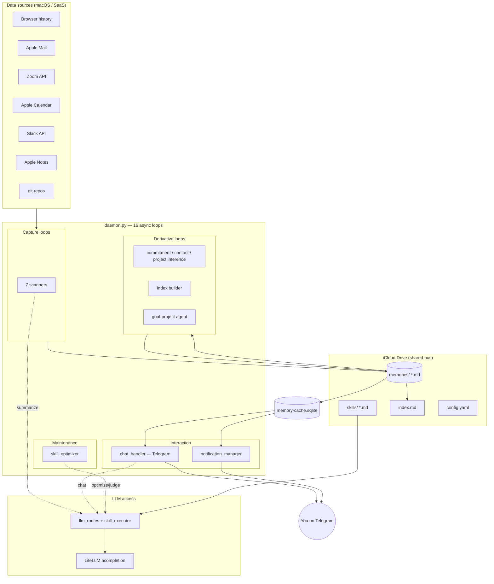
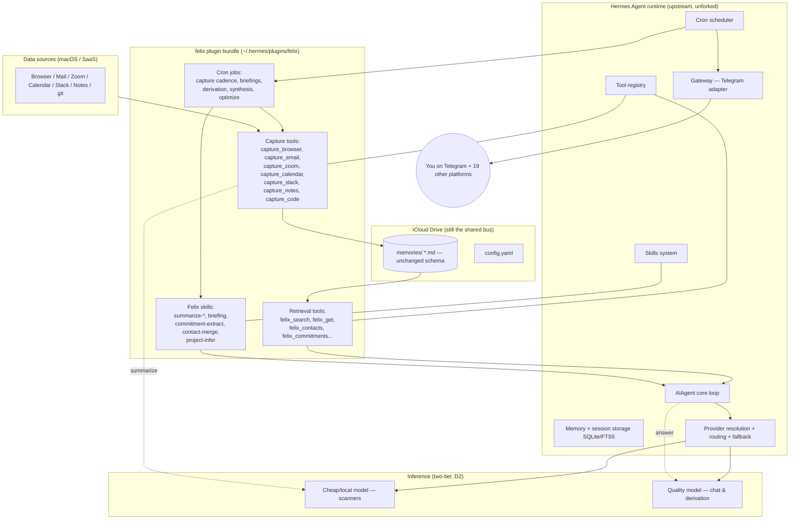
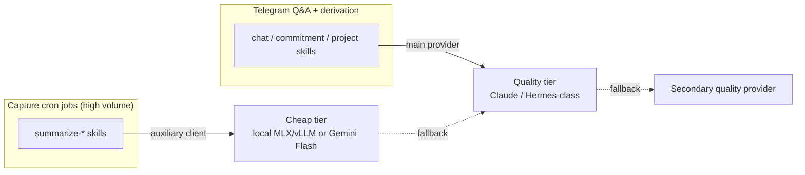
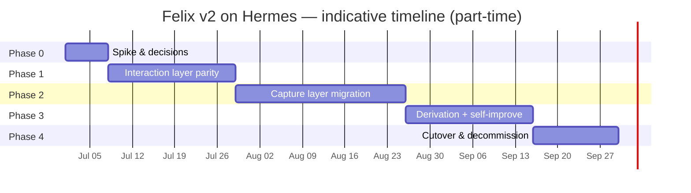

# Felix v2 — Migration to Nous Research Hermes Agent

**Status:** Proposal / roadmap
**Author:** Generated planning doc
**Date:** 2026-06-24
**Target:** Rebuild Felix (this repo, "second-brain") on top of the [Hermes Agent](https://github.com/NousResearch/hermes-agent) runtime, as plugins + skills + cron on unforked upstream.

---

## 1. TL;DR

Felix today is a hand-built personal-knowledge daemon: 16 async loops that capture macOS/SaaS activity, summarize it with LLMs, store flat markdown in iCloud, and expose it through a Telegram bot. It already independently reinvented several things Hermes ships as first-class primitives — skill files, an LLM-as-judge self-improvement loop, a Telegram gateway, provider-aware model routing, and a Karpathy-style flat-file memory.

**Hermes Agent** (Nous Research, MIT, released Feb 2026) is a self-improving agent runtime with: a platform-agnostic agent core, a 20-platform messaging gateway (Telegram included), 70+ tools across 28 toolsets, a skills system on the [agentskills.io](https://agentskills.io) standard, persistent memory + SQLite/FTS5 session storage, first-class agent cron jobs, provider routing/fallback/credential pools, a plugin system, and the Nous Tool Gateway (web/image/TTS/browser).

**Felix v2 strategy (decisions locked below):** keep upstream Hermes unforked and build Felix as a *plugin bundle* — custom capture tools, retrieval tools, skills, and cron jobs — layered on top. The interaction layer (chat, briefings, queries) is mostly *deleted and replaced* by Hermes primitives. The capture layer (the scanners) is the part with no Hermes equivalent; it is *preserved* and re-homed as Hermes custom tools driven by cron. Inference stays two-tier: a cheap/local model for high-volume scanner summarization, a quality model for Telegram answers.

Net effect: Felix sheds an estimated 40–60% of its bespoke infrastructure code (gateway, LiteLLM layer, skill executor, notification scheduler, daemon loop runner) and inherits a large feature surface (MCP, browser automation, voice, subagents, checkpoints, prompt caching, 19 extra chat platforms) "for free," while keeping the macOS capture pipelines that are its actual moat.

---

## 2. Decisions locked

| # | Decision | Choice |
|---|----------|--------|
| D1 | Relationship to upstream `hermes-agent` | **Plugins/skills on top** — do not fork the core. Felix v2 ships as a Hermes plugin bundle + skills + cron jobs. Upgrades stay cheap. |
| D2 | Inference | **Two-tier mix** — cheap/local model (e.g. local MLX/vLLM or Gemini Flash) for high-volume scanner summarization via Hermes' auxiliary client; quality model (Claude/Hermes-class) for Telegram Q&A. |
| D3 | Capture scanners | **Hermes custom tools + cron** — each scanner becomes a registered Hermes tool, invoked on a schedule by a cron job. Capture stays deterministic; only summarization is LLM. |
| D4 | Deliverable (this doc) | **Roadmap + architecture diagrams.** |

---

## 3. Where the two systems already overlap

This is why the migration is tractable rather than a rewrite-from-scratch — Felix's core ideas have direct Hermes counterparts.

| Felix concept | Hermes counterpart |
|---|---|
| Skill `.md` files with embedded execution history | Skills System (agentskills.io standard, progressive disclosure) |
| Skill optimizer (LLM-as-judge, critique-then-edit, evolution log) | [`hermes-agent-self-evolution`](https://github.com/NousResearch/hermes-agent-self-evolution) (DSPy + GEPA) + Hermes' built-in learning loop |
| Telegram bot + slash commands + user whitelist | Gateway Telegram adapter + slash-command dispatch + allowlist/DM pairing |
| LiteLLM route table (`summarize`/`chat`/`optimizer`/`judge`) | Provider resolution + provider routing + fallback providers + auxiliary client tiers |
| Flat-file markdown memory + SQLite read-cache (`memory_cache`) | Persistent memory (`MEMORY.md`/`USER.md`) + session storage (SQLite + FTS5) + pluggable memory providers |
| `index.md` hourly synthesis | Memory synthesis + context engine |
| Notification manager (scheduled briefings) | Cron jobs delivering to any platform |
| `daemon.py` async loop runner + launchd | `hermes gateway` long-running process + cron scheduler + profile isolation |
| Untrusted-input delimiters for prompt-injection containment | Carried forward inside Felix capture tools (Hermes does not remove the need) |

The pieces with **no** Hermes equivalent — and therefore the real work — are the **domain capture pipelines**: reading Chrome/Firefox history SQLite, Apple Mail, Zoom VTT, Apple Calendar, Slack, Apple Notes, and git repos, plus the **derivation logic** (commitment/contact/project inference). Those are Felix's IP and must be preserved.

---

## 4. Current architecture (Felix v1)



Key facts that constrain the migration:

- **All LLM calls funnel through one place** — `skill_executor.SkillExecutor` calling `litellm.acompletion`, with route aliases resolved by `llm_routes.resolve()` and a provider switch already driven by `SECOND_BRAIN_PROVIDER`. This is the clean seam Hermes plugs into.
- **The memory corpus is the source of truth**, and every reader goes through `memory_cache.MemoryCache` (a derived SQLite/FTS index over the iCloud markdown). Felix v2 keeps the corpus and re-points the read path at a Hermes retrieval tool.
- **Two roles** (`full` / `watcher`) coordinate via the iCloud bus and a per-machine env var. This maps cleanly to Hermes **profiles**.
- **Capture is deterministic**, summarization is the only LLM step in scanners. Preserve that boundary — do not let the agent loop "decide" what to capture.

---

## 5. Target architecture (Felix v2 on Hermes)



What changed vs v1:

- `daemon.py`, the async-loop runner, `chat_handler.py`, `notification_manager.py`, `skill_executor.py`, `llm_routes.py`, and the LiteLLM dependency are **retired**. Their responsibilities move to Hermes' gateway, cron, agent loop, and provider resolution.
- The **scanners' capture logic survives** but is repackaged: each becomes a registered Hermes tool; cron decides when it runs.
- The **memory corpus survives unchanged** — same filenames, same frontmatter schema — so no data migration and watcher/full multi-machine sync keeps working. Hermes reads it through a `felix_search` retrieval tool (which can wrap the existing `memory_cache` FTS index or be rebuilt on Hermes' FTS5).
- The huge Telegram command surface (~80 slash commands) collapses: high-value commands become Hermes slash commands or skills, while many "show me X" queries become natural-language requests the agent answers via retrieval tools — fewer commands to maintain.

---

## 6. Component-by-component mapping

| Felix v1 module | Responsibility | Hermes v2 mechanism | Action |
|---|---|---|---|
| `daemon.py` | Async loop orchestration, role gating | `hermes gateway` + cron scheduler; profiles for roles | **Retire.** Replace with gateway process + cron jobs. |
| `chat_handler.py` | Telegram bot, command registry, context loading, chunking | Gateway Telegram adapter + slash commands + retrieval tools + context engine | **Retire.** Port commands to slash commands/skills; context via `felix_search`. |
| `notification_manager.py` | Briefings, pre-meeting push, deadline alerts | Cron jobs delivering to Telegram | **Reimplement** as cron schedules. |
| `skill_executor.py` | Load skill md, call LiteLLM, log execution, tool loop | Agent loop + tool dispatch + skills system | **Retire.** Logic absorbed by Hermes core. |
| `llm_routes.py` | Alias → model ID, provider switch | Provider resolution + routing + auxiliary client | **Retire.** Configure in `config.yaml`. |
| `usage_tracker.py` | Token usage per model | Nous Portal dashboard / provider usage | **Slim** or drop; keep a light hook if you want local stats. |
| `memory_cache.py` | SQLite/FTS read-cache over corpus | Session storage (SQLite+FTS5) + a `felix_search` tool | **Keep as the engine** behind `felix_search`, or rebuild on Hermes FTS5. |
| `memory_writer.py` | Atomic markdown writes | Reused inside capture tools | **Keep** (import into capture tools). |
| `browser_watcher.py` | Chrome/Firefox history → summarize → memory | `capture_browser` tool | **Repackage** as tool; cron-driven. |
| `email_scanner.py` | Apple Mail → email-thread memories | `capture_email` tool | **Repackage.** |
| `zoom_scanner.py` | Zoom VTT → meeting memories | `capture_zoom` tool | **Repackage.** |
| `calendar_scanner.py` | Apple Calendar → event memories | `capture_calendar` tool | **Repackage.** |
| `slack_scanner.py` | Slack → thread memories | `capture_slack` tool (or MCP Slack) | **Repackage.** |
| `notes_scanner.py` | Apple Notes → note memories | `capture_notes` tool | **Repackage.** |
| `code_scanner.py` | git repos → code memories | `capture_code` tool | **Repackage.** |
| `commitment_tracker.py` | Extract commitments from comms | Cron agent task + `commitment-extract` skill + writer | **Reimplement** as scheduled skill. |
| `contact_tracker.py` | Aggregate participants → contacts | Cron agent task + `contact-merge` skill | **Reimplement.** |
| `project_inference_scanner.py` | Infer projects from comms | Cron agent task + `project-infer` skill | **Reimplement.** |
| `goal_project_agent.py` | Propose actions on goals/projects | Cron agent task (this is literally what Hermes cron is for) | **Reimplement.** |
| `index_builder.py` | Hourly `index.md` synthesis | Memory synthesis cron → `MEMORY.md` | **Reimplement.** |
| `skill_optimizer.py` | Daily skill self-improvement | `hermes-agent-self-evolution` (DSPy+GEPA) or maintenance cron | **Replace** with self-evolution repo. |
| `github_client.py` | GitHub Issues for /feature /bug | MCP GitHub server or `github` tool | **Replace** with MCP. |
| `goals_tracker.py` | Goal/project CRUD | Retrieval/mutation tools (`felix_goal_*`) | **Repackage** as tools. |
| skill `.md` files | Summarizer prompts | Hermes skills (agentskills.io) | **Convert** format. |
| `install.sh` + plist | Deploy + launchd | `hermes setup` + plugin install + cron register + launchd for `hermes gateway` | **Rewrite** installer. |
| `config.yaml` (iCloud) | Roles, thresholds, routing | Hermes `config.yaml` + felix plugin config | **Restructure.** |

---

## 7. Inference tiering (D2)

Felix v1 already tiers models. Hermes expresses the same idea natively: the **main provider** handles agent reasoning and chat; the **auxiliary client** handles cheap side-tasks (summarization, vision, compression); **provider routing + fallback + credential pools** give resilience.



Concretely in Hermes config: set the main provider/model to the quality tier; configure the **auxiliary client** (used for summarization/vision/compression) to the cheap/local tier; add a **fallback provider** so a local-endpoint outage degrades to a cloud model instead of dropping captures. Per-scanner skills declare which tier they want via their model preference, mirroring today's `preferred_model`/`fallback_model` frontmatter.

This keeps the cost profile Felix already has: pennies for the firehose of page/email/meeting summaries, quality spend only on the comparatively rare Telegram conversations and nightly derivation.

---

## 8. Memory strategy

Felix's "files + LLM = database" philosophy is fully compatible with Hermes, which also leans on flat files (`MEMORY.md`, skills, context files) and a SQLite/FTS5 layer. Recommendation:

1. **Keep the iCloud markdown corpus as the system of record**, schema unchanged. This preserves multi-machine sync and means zero data migration.
2. **Expose it to the agent via a `felix_search` retrieval tool** backed by the existing `memory_cache` FTS index (or rebuilt on Hermes' FTS5). This replaces `chat_handler`'s keyword-intersection context loader and is strictly better (FTS5 ranking, no 20-file cap hack).
3. **Use Hermes session storage** for conversation continuity (it already does lineage + compression — Felix never had this).
4. **Defer external memory providers** (Mem0, Honcho, etc.) — they're a v2.x enhancement, not needed for parity. The built-in `MEMORY.md`/`USER.md` plus the corpus is enough.

---

## 9. Phased roadmap



### Phase 0 — Spike & decisions (~1 week)

Goal: prove every Hermes seam Felix depends on, on a throwaway profile, before committing.

- Install `hermes-agent`; run an isolated profile: `hermes -p felix-dev`.
- Configure the two-tier inference (main = quality, auxiliary = cheap/local) and confirm both fire.
- Stand up the Telegram gateway with your user on the allowlist; confirm round-trip.
- Create one cron job that posts a canned message to Telegram on a schedule.
- Write one trivial custom tool in a felix plugin and confirm it registers and is callable.
- Lock the memory decision (wrap `memory_cache` vs rebuild on FTS5) by prototyping `felix_search` against the real corpus.

Exit criteria: Telegram in/out, cron→Telegram, a custom tool, and a retrieval query against the live corpus all working on `felix-dev`.

### Phase 1 — Interaction layer parity (~2–3 weeks)

Goal: you can ask Felix anything and get briefings, with scanners *still running on the old daemon* (dual-run, zero risk).

- Scaffold the `felix` plugin bundle (`~/.hermes/plugins/felix/`).
- Build retrieval/mutation tools over the corpus: `felix_search`, `felix_get`, `felix_contacts`, `felix_commitments`, `felix_events`, `felix_meetings`, `felix_code`, `felix_notes`, `felix_comms`, `felix_goals`, `felix_projects`.
- Port the high-value slash commands; let everything else become natural-language queries the agent answers via the tools.
- Reimplement briefings as cron jobs: daily (07:30), midday (12:00), end-of-day (17:00), each delivering to Telegram.
- Reimplement pre-meeting context push and commitment/goal deadline alerts as cron jobs that call `felix_events`/`felix_commitments`.
- Keep the old `daemon.py` running for capture only; Hermes only reads.

Exit criteria: every read command and every proactive notification has a Hermes equivalent at parity; the old chat_handler and notification_manager can be turned off without losing function.

### Phase 2 — Capture layer migration (~3–4 weeks)

Goal: move capture into Hermes, one source at a time, verifying memory parity before decommissioning each old loop.

- Wrap each scanner's capture+summarize logic as a custom tool: `capture_browser`, `capture_email`, `capture_zoom`, `capture_calendar`, `capture_slack`, `capture_notes`, `capture_code`. Reuse `memory_writer` and the untrusted-input delimiters verbatim.
- Summarization inside these tools uses the **cheap tier** via the auxiliary client.
- Register a cron job per scanner at its current cadence (5 min for most, 15/30/60 as today).
- **Watcher role → a Hermes profile** that runs only the capture cron, no gateway.
- Decommission each old async loop only after its tool produces byte-comparable memory files for a verification window.
- Re-validate macOS permissions (Full Disk Access, Calendar/EventKit, Automation) under the `hermes gateway` process context — this is the highest-risk item (see §11).

Exit criteria: all seven capture sources run as Hermes tools/cron; `daemon.py` no longer needed for capture; memory output verified equivalent.

### Phase 3 — Derivation + self-improvement (~2–3 weeks)

Goal: move the "thinking about the corpus" loops and the optimizer onto Hermes.

- Reimplement commitment extraction, contact merging, and project inference as cron agent tasks driven by Felix skills (`commitment-extract`, `contact-merge`, `project-infer`), reading the corpus and writing derived memories.
- Reimplement `index_builder` as a memory-synthesis cron that maintains `MEMORY.md` (and/or keeps `index.md` for back-compat).
- Reimplement the goal/project agent as a cron agent task — this is the most natural Hermes fit (it *is* a scheduled agent that proposes actions).
- Replace `skill_optimizer` with [`hermes-agent-self-evolution`](https://github.com/NousResearch/hermes-agent-self-evolution) (DSPy + GEPA) operating over the Felix skills; wire `/wrong` and `/missed` feedback into its training corpus.
- Convert the `summarize-*.md` skills to Hermes skill format.

Exit criteria: derivation and optimization run under Hermes; accuracy stats hold steady or improve vs v1 baseline.

### Phase 4 — Cutover & decommission (~1–2 weeks)

Goal: make Hermes the only runtime; delete the v1 scaffolding.

- Replace `install.sh`/launchd with a new installer that: installs `hermes-agent` (pinned version), deploys the felix plugin + skills + cron jobs + config, and runs `hermes gateway` under launchd.
- Migrate `/feature` and `/bug` to an MCP GitHub server (optionally reimplement `work_reports.sh` via `delegate_task` subagents).
- Delete `daemon.py`, `chat_handler.py`, `notification_manager.py`, `skill_executor.py`, `llm_routes.py`, the LiteLLM dependency, and now-dead scanner loop wrappers (keep the capture logic that moved into tools).
- Update `README.md`, `CLAUDE.md`, `CHANGELOG.md`; bump `VERSION` to `2.0.0` (major — deployment model changed).
- Keep the v1 daemon tagged and revertable for one release cycle.

Exit criteria: Hermes is the sole process; docs updated; v2.0.0 tagged.

---

## 10. What Felix gains and keeps

**Gained for free from Hermes:** 19 additional messaging platforms (Discord, Slack, WhatsApp, Signal, Email, …); the MCP ecosystem (drop-in GitHub/DB/API tools); browser automation; voice mode + TTS; image generation; subagent delegation; `execute_code`; working-directory checkpoints/rollback; cross-session prompt caching; provider fallback + credential pools; an OpenAI-compatible API server; IDE/ACP integration; mature session storage with compression; and the Tool Gateway if you ever want managed web/image/browser.

**Kept as Felix's own IP:** the macOS/SaaS capture pipelines (no Hermes equivalent), the domain memory schema, the commitment/contact/project derivation logic, and the proactive personal-knowledge product behavior.

**Deleted complexity:** the async-loop daemon, the bespoke Telegram bot, the LiteLLM routing layer, the skill executor, the notification scheduler, and the hand-rolled context loader.

---

## 11. Risks & watch-outs

| Risk | Severity | Mitigation |
|---|---|---|
| **macOS permissions under the Hermes process** (FDA for Mail/Calendar SQLite, EventKit, Automation/AppleScript) may behave differently than under the current plist; Homebrew Python ad-hoc-signing already bites Felix today. | High | Validate in Phase 0/2 with the actual `hermes gateway` binary/process; keep AppleScript fallbacks; document the TCC grants the hermes process needs. |
| **Hermes is fast-moving** (MIT, 2026, frequent releases). Plugin/skill APIs may shift. | Medium | Pin a Hermes version; track release notes; the unforked plugin approach (D1) is specifically chosen to minimize merge pain. |
| **Determinism loss** — capture must not become "agent decides what to capture." | Medium | Keep capture tools deterministic; the agent loop only orchestrates scheduling and summarization, never selection logic. |
| **Prompt-injection containment** — captured web/email/Slack content is untrusted. | Medium | Carry the existing `<untrusted-input>` delimiter discipline into every capture tool; do not rely on Hermes to add it. |
| **Memory dual-write confusion** — Hermes session storage vs the iCloud corpus. | Medium | Corpus is the single source of truth; session storage is conversation-only; `felix_search` is the one read path. |
| **Command-surface regression** — ~80 v1 slash commands. | Low/Med | Port only high-value commands; lean on natural-language + retrieval tools for the long tail; track parity in a checklist. |
| **Self-evolution maturity** — DSPy+GEPA repo is new. | Low | Optimizer is non-critical; if it's not ready, run a simple maintenance cron (LLM-as-judge) as an interim, mirroring v1. |
| **Multi-machine sync** — watcher/full coordination. | Low | Map roles to Hermes profiles; corpus still syncs via iCloud exactly as today. |

---

## 12. Testing & rollback

- **Keep `pytest`** for capture/derivation logic — that code moves into tools but the unit tests (mocked LLM + `tmp_path`) port almost unchanged. This is the safety net for Phase 2/3 parity checks.
- **Parity verification:** for each migrated scanner, run old loop and new tool in parallel and diff the produced memory files (canonicalized, ignoring timestamps) over a verification window before cutover.
- **Dual-run rollback:** Phases 1–3 run Hermes alongside the v1 daemon. At any point you can disable the Hermes cron job and re-enable the old loop.
- **Profile isolation:** all development happens on `hermes -p felix-dev`; production is a separate profile, so experiments never touch live memory or the live gateway.
- **Version safety net:** tag the last v1 commit; keep it deployable for one release cycle after v2.0.0.

---

## 13. Effort summary

| Phase | Scope | Indicative effort (part-time) |
|---|---|---|
| 0 | Spike & decisions | ~1 week |
| 1 | Interaction parity (tools, briefings) | ~2–3 weeks |
| 2 | Capture migration (7 scanners → tools/cron) | ~3–4 weeks |
| 3 | Derivation + self-improvement | ~2–3 weeks |
| 4 | Cutover & decommission | ~1–2 weeks |
| | **Total** | **~9–13 weeks part-time** |

The biggest single chunk is Phase 2 (capture), because that's the code with no Hermes equivalent and the macOS-permission risk. Phases 1, 3, and 4 are largely *deletion plus re-expression* of things Hermes already does.

---

## 14. Open questions to resolve during Phase 0

1. Exact cheap-tier endpoint for the auxiliary client — local MLX/vLLM (from the `hermes` repo's `mac-studio`/`spark-dgx` hosts) or Gemini Flash? (Affects offline behavior and the fallback chain.)
2. `felix_search`: wrap the existing `memory_cache` SQLite/FTS or rebuild on Hermes FTS5? (Phase 0 prototype decides.)
3. Which v1 slash commands are "must-keep as commands" vs "fine as natural language"? (Drives the Phase 1 port list.)
4. Slack capture: keep the custom scanner logic, or adopt an MCP Slack server?
5. Is the Nous Tool Gateway / Portal subscription in scope at all, or strictly bring-your-own-keys?
```
